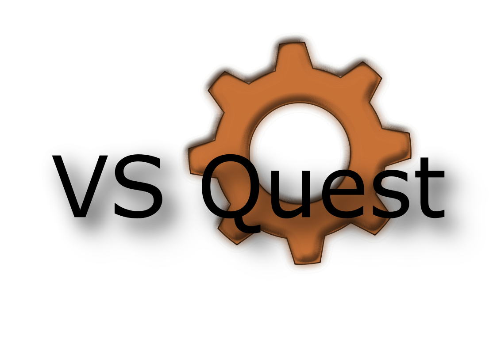

# VS Quest

Die Mod aims to add Quests to Vintage Story. 
It should also enable you to easily add your own quests to the game as well as your own questgivers. 
 
If you want to use this as a base for creating your own quests, please have a look at this **[example](example)**. The most important aspects to take care of are the **[quests.json](example/assets/vsquestexample/config/quests.json)** as well as the **[questgiver behavior](example/assets/vsquestexample/entities/questgiver.json#L229-L235)**  
Every quest in the quests.json can have the following attributes:
* **id**: Unique id to identify your quest in the system
* **cooldown**: cooldown in days until the questgiver offers the quest again
* **predecessor**: optional -> questid that has to be completed before this quest becomes available
* **perPlayer**: determines if the quest cooldown is set per player or globally
* **onAcceptedActions**: list of actions that are executed after the quest was accepted
  * **id**: unique id of the action
  * **args**: arguments for the function called by the action, all supplied as strings
* **gatherObjectives**: list of items the player has to offer
  * **validCodes**: list of accepted item codes
  * **demand**: needed amount
* **actionObjectives**: list of objectives that rely on custom code
  * **id**: unique id of the action objective to check
  * **args**: arguments for the function called by the action objective, all supplied as strings
* **killObjectives**: list of entities the player has to defeat
  * **validCodes**: list of accepted entity codes
  * **demand**: needed amount
* **blockPlaceObjectives**: list of blocks the player has place
  * **validCodes**: list of accepted block codes
  * **demand**: needed amount
* **blockBreakObjectives**: list of blocks the player has break
  * **validCodes**: list of accepted block codes
  * **demand**: needed amount
* **itemRewards**: list of items the player receives upon completing the quest
  * **itemCode**: code of the reward
  * **amount**: amount the player receives
* **randomItemRewards**: if you want to reward the player with a random reward (something like "select 3 out of 7 possible items") this is the place to go
  * **selectAmount**: specifies how many of the item entries should be randomly selected
  * **items**: list of items to randomize from
    * **itemCode**: code of the reward
    * **minAmount**: minimum amount of that item to drop
    * **mayAmount**: maximum amount of that item to drop
* **actionRewards**: list of rewards that rely on custom code, like spawning a certain creature, ...
  * **id**: unique id of the action
  * **args**: arguments for the function called by the action, all supplied as strings
  * **currently available actions (can be used both as actionRewards and onAcceptedActions)**:
    * despawnquestgiver: despawns the questgiver after the given amount of time
      * args: ["8"] => questgiver is despawned after 8 seconds
    * playsound: plays the given sound at the players position (only hearable by the player himself)
      * args: ["game:sounds/voice/saxophone"] => plays the saxophone sound
    * spawnentities: spawns all entities provided
      * args: ["game:wolf-male", "game:wolf-female"] => spawns a male and a female wolf
    * spawnany: spawns a randome entity
      * args: ["game:wolf-male", "game:wolf-female"] => spawns either a male or a female wolf
    * recruitentity: recruits the questgiver (requires custom aitasks and is used by vsvillage)
      * args: none
    * addplayerattribute: adds an attribute as string to the watched attributes of the player, useful for storing custom data
      * args: ["isacoolguy","yes"] => sets the isacoolguy attribute of the player to yes
    * removeplayerattribute: remove a playerattribute
      * args: ["isacoolguy"] => deletes the isacoolguy attribute
    * completequest => completes the given quest
      * args: ["25", "vsquestexample:talktome"] => completes the quest vsquestexample:talktome where the questgivers entity id is 25
    * acceptquest: adds a quest to the active quests of the player
      * args: ["25", "vsquestexample:talktome"] => adds vsquestexample:talktome with questgiver 25 to the active quests of the player
    * giveitem: gives an item to the player
      * args: ["game:gear-rusty", "1"] => gives 1 rusty gear to the player

To convert an entity to a questgiver it needs the questgiver behavior:
* **quests**: list of quests the questgiver offers
* **selectrandom**: if set to true, the questgiver will only offer a random selection of its quests
* **selectrandomcount**: determines the number of random quests the questgiver offers

